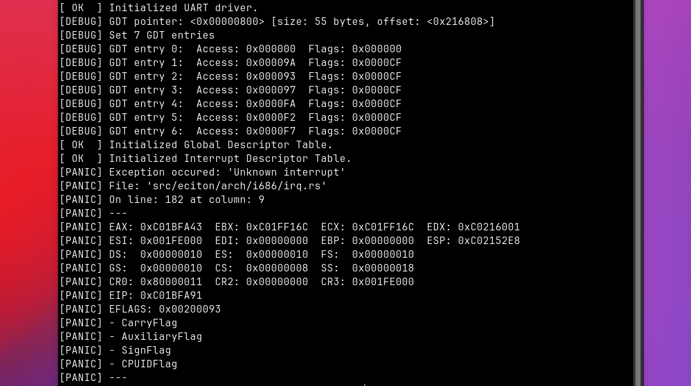

# Eciton exokernel changes log

## release v0.0.1

|Language| files | blank | comment | code |
|--------|-------|-------|---------|------|
|Rust    |     17|    203|      685|   985|
|Assembly|      3|     48|       58|   207|
|SUM:    |     20|    251|      743|  1192|

| Total lines |  Size (with debug symbols)  |  Pure size              |
|-------------|-----------------------------|-------------------------|
| 2186        | 4015140 bytes (3.9 MB)      | 1647740 bytes (1.6 MB)  |

### List of changes

* feat: added `pr_panic!()` macro
* feat: added kernel `memory dump` function
* feat: added registers dump on kernel panic
* feat: added `dump_registers()` function
* feat: added `register` handeling functions
* feat: added `pr_ok!()`, `pr_err!()` & `pr_debug!()` macros
* feat: added `Interrupt Descriptor Table`
* feat: added `Interrupt Requests (IRQ)` module
* feat: added `sti()` & `cli()` functions
* feat: added `PIC`
* feat: added `Global Descriptor Table`
* feat: added `printk!()` macro
* feat: added `UART` driver
* feat: added `inb()` & `outb()` functions
* feat: added makefile
* feat: added `i686` architecture related modules
* feat: added kernel `panic` handler
* feat: added `multiboot` info structs